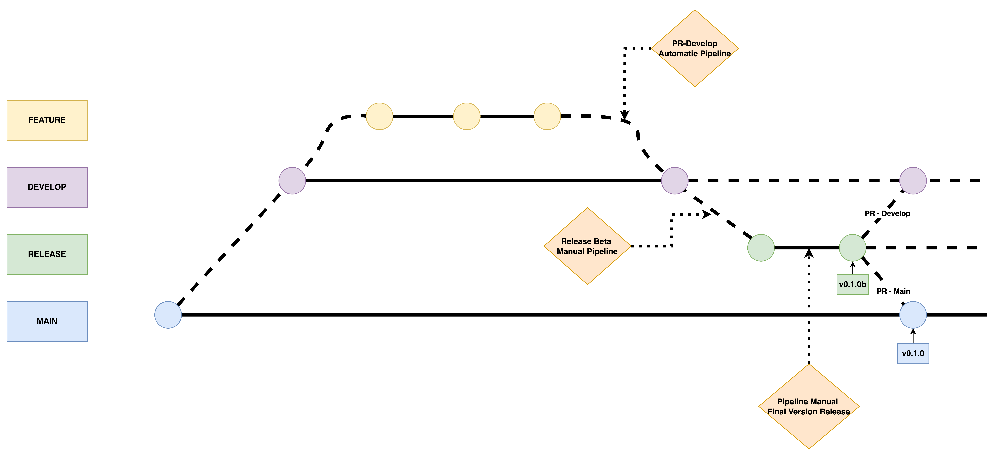

# Introduction

This project demonstrates how to leverage Azure Pipelines and Azure Artifacts to automate the development, packaging, and deployment of a Python common library. By using Twine for secure publishing and Poetry for dependency management and packaging, we create a streamlined approach to share a standardized library across projects.

## Table of contents

- [Introduction](#introduction)
  - [Table of contents](#table-of-contents)
  - [Overview](#overview)
  - [Key Components](#key-components)
  - [What do you need to understand this article?](#what-do-you-need-to-understand-this-article)
  - [Project Structure](#project-structure)
  - [Framework Core](#framework-core)
  - [Workflow](#workflow)
  - [Azure Pipeline](#azure-pipeline)
  - [Developer Code](#developer-code)
  - [Conclusions](#conclusions)

## Overview

We have all started a project between several developers and started to create our own libraries without thinking about creating a common library repository. In this project we will see the benefit of establishing common libraries, promoting code reuse, improving maintainability and helping to standardize functionality between teams. A shared library ensures that all developers work with consistent tools, patterns and dependencies, which reduces code duplication and increases productivity.

By using Azure DevOps services, this repository automates the setup and deployment of such a library:

- Azure Pipelines: Orchestrates CI/CD workflows, automatically testing, packaging, and preparing the library for publication with each change, ensuring stability and version control.
- Azure Artifacts: Acts as a secure package registry for hosting and sharing the Python library across teams, enabling quick access and seamless updates.

This project also incorporates Poetry to manage dependencies and streamline packaging, creating an isolated, reproducible environment. Twine is used for secure authentication and publishing to Azure Artifacts, making the package readily available for other applications.

## Key Components:

- Poetry: Manages dependencies and builds the project into a Python package.
- Twine: Handles secure authentication and publishing of the package to Azure Artifacts.
- Azure Pipelines: Executes CI/CD workflows to automate testing, building, and deployment.
- Azure Artifacts: Serves as the package registry, hosting the Python package for shared usage.
This guide provides a foundational setup for creating and deploying a Python library, allowing teams to streamline development workflows and promote code reuse across projects within Azure DevOps.

## What do you need to understand this article?

- Some concepts of [Python](https://www.python.org/).
- Some concepts of [Poetry](https://python-poetry.org/).
- Some concepts of [Twine](https://pypi.org/project/twine/).
- Some concepts of [Azure Pipelines](https://azure.microsoft.com/es-es/products/devops/pipelines).
- Some concepts of [Azure Artifacts](https://azure.microsoft.com/es-es/products/devops/artifacts).
- Some concepts of [Azure](https://azure.microsoft.com/).
- A Azure and Azure DevOps account.

## Project Structure

```bash
|-- .devcontainer/
|-- images/
|-- src_core/
|-- src_developer/
|-- README.md

```

- devcontainer: Contains configuration files for setting up a development container. This enables a consistent development environment across all developers, ensuring that everyone has the same dependencies, tools, and settings when working on the project.

- images:  Likely contains images or other media assets that are used within the repository, such as architecture diagrams, workflow images, or documentation visuals. This folder can be used to keep non-code assets organized and separated from source code.

- src_core: This folder contains the core framework code developed by the Core Team. It is the shared codebase that other developers rely on to build their own applications or features. Any changes made here affect all dependent projects, so it is managed with versioning and strict quality control.

- src_developer: Contains additional or sample code for developers who use the core framework. This folder provide examples of the core framework, serving as a guide for developers or as a place to test the integration of core components.

- README.md: The main documentation file for the project. It provides an overview of the project, instructions for getting started, and details on how to use the framework and any dependencies. This README is a good place to explain the purpose of each folder, prerequisites, setup instructions, and how to contribute.

## Framework Core

A comprehensive collection of production-ready utility modules for Python applications, providing standardized implementations for common operations such as logging, database connectivity, secret management, and general-purpose utilities. This library will serve as the foundation for all future developments within our example organization.

To streamline development and ensure efficiency, this project uses Poetry for dependency management and packaging. Poetry provides a modern and robust way to manage Python dependencies and virtual environments. Additionally, Poetry extras are utilized to allow developers to selectively install only the packages they need for their specific tasks, rather than downloading the entire set of dependencies.

For instance, a developer focusing on azure connectivity can install the necessary extras using:

```sh
poetry install --extras=azure
```

This modular approach reduces overhead, speeds up setup times, and ensures that developers work with a lightweight and focused environment tailored to their needs.

By leveraging Poetry and extras, this project aims to provide both flexibility and scalability for ongoing development across the organization.

### 🌟 Features

- Dependency Injection Container
- Configuration Management
- Logging System
- Database Abstraction Layer
- Security Utilities
- String and Date Utilities

The structure of our project is as follows:

```
core/
├── database
    ├── azuretablestorage.py
    ├── __init__.py
├── logging
    ├── opentelemetrylogger.py
    ├── __init__.py
├── secrets
    ├── keyvaultmanager.py
    ├── __init__.py
├── utils
    ├── dateutils.py
    ├── stringutils.py
    ├── __init__.py
└── tests/
    ├── database
        ├── test_azuretablestorage.py
    ├── secrets
        ├── test_keyvaultmanager.py
    ├── utils
        ├── test_dateutils.py
        ├── test_stringutils.py
```

### Benefits

## Workflow

For the development of the core framework, a GitFlow-oriented workflow will be implemented to ensure a structured and efficient process. The diagram below illustrates the steps and branches involved in this workflow.

<p align="center">
  
</p>

Here's an explanation of the key elements in the diagram:
### Key Branches

1. Feature:

  * Represents individual branches for feature development.
  * Each feature branch originates from the develop branch and is later merged back into develop.

2. Develop:

  * A long-lived branch where integration of features takes place.
  * It serves as the main branch for ongoing development and testing.
  * Changes from develop may undergo an automatic pipeline process (PR - Develop) to ensure code quality.

3. Release:

  * After feature development is stabilized, a release branch is created from develop.
  * This branch is subject to a Release Beta Manual Pipeline, ensuring that pre-release testing is conducted.

4. Main:

  * The production branch.
  * Stable, final versions (e.g., v0.1.0) are released here.
  * Changes are merged into main via a Pull Request (PR - From Release to Main) after completing all testing and quality checks.

### Pipelines

1. PR - Develop Automatic Pipeline:

  * This pipeline runs automatically when a pull request is merged from feature branch into develop branch.
  * It likely includes automated tests, code reviews, and builds to validate the integration.

The following diagram shows the steps that the pipeline will perform:

<p align="center">
  
</p>

  * Actors:
    1. Core Team:
      * Developers responsible for creating and pushing feature branch changes to Azure Repos.
    2. Reviewer:
      * A team member who reviews the pull request (PR) before it is merged into develop.

  * Flow Explanation:
    1. Code Commit to Azure Repos:
      * A developer from the core team pushes changes to a feature branch hosted in Azure Repos.
    2. Pull Request (PR) - Feature to Develop:
      * The developer creates a pull request to merge the feature branch into the develop branch.
      * This triggers automated processes defined in Azure DevOps pipelines.
    3. Precommit/QA:
      * The PR undergoes precommit checks and quality assurance (QA).
      * This may include linting, static code analysis, and unit tests.
    4. Testing:
      * Automated tests are executed, ensuring that the feature branch is stable and does not break existing functionality.
    5. Teams Notification:
      * Once automated processes complete, notifications are sent to the reviewer via Microsoft Teams.
      * The reviewer is informed that the PR is ready for manual review.
    6. Manual Review:
      * The reviewer evaluates the changes, provides feedback if necessary, and approves the PR if it meets the required standards.

This flow ensures that all changes are thoroughly tested and reviewed before integration, maintaining the stability and quality of the develop branch.

2. Release Beta Manual Pipeline:

  * It is executed manually to create a release branch with the new changes to be added to the new version.
  * Release a beta version for developers to test the new changes.

The following diagram shows the steps that the pipeline will perform:

<p align="center">
  
</p>

  * Actors:
    1. Core Team:
      * Responsible for triggering the release process from the develop branch in Azure Repos.
    2. Develop Team:
      * The team that receives the published artifacts and release notes for further testing or deployment.

  * Flow Explanation:
    1. Manual Pipeline Trigger:
      * A manual release process is initiated for the develop branch in Azure DevOps.
    2. Precommit/QA:
      * The pipeline runs precommit checks and quality assurance steps.
      * This includes linting, code formatting, and static analysis.
    3. Testing:
      * Automated tests are executed to ensure the stability of the branch.
      * This can include unit tests, integration tests, or other automated testing mechanisms.
    4. Create Branch Release:
      * A release version is created from the develop branch.
      * This step ensures the branch is tagged and prepared for artifact generation.
    5. Publish Artifacts:
      * The pipeline builds and publishes the necessary artifacts, in that case with twine.
      * These artifacts are stored in a Azure Artifacts.
    6. Teams/Notes Notification:
      * Notifications are sent via Microsoft Teams, along with release notes.
      * The development team is informed that the release artifacts are ready for use.

This process ensures that releases from the develop branch are stable, thoroughly tested, and well-documented. It provides transparency and prepares the development team for the next stages of deployment or integration.

3. Pipeline Manual Final Version Release:

  * Manually executed when you want to create a final version to publish to all developers.

The following diagram shows the steps that the pipeline will perform:

<p align="center">
  
</p>

  * Actors:
    1. Core Team:
      * Responsible for developing, maintaining, and preparing the core library for release.
      * Ensures the code meets organizational standards before initiating the release process.
    2. Reviewers:
      * Reviews and approves pull requests to ensure the quality, functionality, and adherence to standards of the core library.
      * Facilitates the manual approval process.
    3. Develop Team:
      * The end-users of the core library. They use the published version in their projects for consistent and standardized functionalities.

  * Flow Explanation:
    1. Manual Pipeline Trigger:
      * The Core Team designates the stable and production-ready version of the core library to be released.
      * Running the Release Pipeline Manually
    2. Pull Request to Develop
      * A new version is created deleted the beta sufix.
      * A Pull Request (PR) is created to merge the definitive version into the develop and main branch.
    3. Manual Approval
      * The PR undergoes a manual review process where Reviewers validate the changes for quality, compatibility, and adherence to standards.
      * Only after this approval can the release move forward.
    4. Publish Artifacts - Final Version
      * The final version of the library is packaged and published as artifacts in a repository (Azure Artifacts).
      * This step ensures the library is accessible for all developers in the organization.
    5. Teams/Notes Notification
      * A notification is sent via Microsoft Teams or other communication channels to inform the Develop Team about the new release.
      * This notification often includes release notes and usage instructions.
    6. Develop Team Usage
      * The Develop Team integrates the released core library into their projects, leveraging its standardized utilities and features to streamline their development.

### Tagging

  * Versions are tagged at specific points:
    * v0.1.0b for a beta release on the release branch.
    * v0.1.0 for the final release on the main branch.

## Azure Pipeline

This pipeline is designed to automate the development, testing, and release workflow for a Python package. By integrating Poetry for dependency management and leveraging CI/CD in Azure DevOps, the pipeline streamlines the process of building and distributing a Python package for other developers. The pipeline that will display all the changes is as follows:

```yaml
parameters:
- name: version
  type: string
  default: minor
  values:
  - major
  - minor
  - patch

trigger:
  branches:
    include:
    - main

pr:
  branches:
    include:
    - main
    - develop
    exclude:
      - feature/experimental/*
  paths:
    include:
      - '**/*'
variables:
  BRANCH_NAME: $[replace(variables['Build.SourceBranch'], 'refs/heads/', '')]

jobs:
  - job: PR_Develop
    condition: and(eq(variables['Build.Reason'], 'PullRequest'), startsWith(variables['System.PullRequest.SourceBranch'], 'refs/heads/feature/'), eq(variables['System.PullRequest.TargetBranch'], 'refs/heads/develop'))
    steps:
      - task: UsePythonVersion@0
        inputs:
          versionSpec: '3.11'
        displayName: 'Set up Python'
      - script: |
          python -m pip install --upgrade pip
          pip install poetry pytest twine pre-commit
        displayName: 'Install dependencies: poetry, pre-commit, twine and pytest'
      - script: |
          pre-commit run -a
        displayName: 'Execute pre-commit stuff'
      - script: |
          poetry lock --no-update
          poetry install --all-extras
        displayName: 'Execute poetry install'
      - script: |
          poetry run pytest
        displayName: 'Execute poetry pytest'
  - job: Develop
    condition: eq(variables.BRANCH_NAME, 'develop')
    steps:
      - checkout: self
        persistCredentials: true
        fetchDepth: 0
      - task: UsePythonVersion@0
        inputs:
          versionSpec: '3.11'
        displayName: 'Set up Python'
      - script: |
          python -m pip install --upgrade pip
          pip install poetry pytest twine pre-commit
        displayName: 'Install dependencies: poetry, pre-commit, twine and pytest'
      - script: |
          pre-commit run -a
        displayName: 'Execute pre-commit stuff'
      - script: |
          poetry lock --no-update
          poetry install --all-extras
        displayName: 'Execute poetry install'
      - script: |
          poetry run pytest
        displayName: 'Execute poetry pytest'
      - task: Bash@3
        name: CreateReleaseBranch
        inputs:
          targetType: 'inline'
          script: |
            git config --global user.email "$(Build.RequestedForEmail)"
            git config --global user.name "Azure Pipelines"
            git checkout develop

            # Get current version
            CURRENT_VERSION=$(python setup.py --version)

            # Split version into parts
            IFS='.' read -r -a version_parts <<< "$CURRENT_VERSION"

            # Calculate new version
            case "${{ parameters.version }}" in
              "major")
                NEW_VERSION="$((${version_parts[0]}+1)).0.0b0"
                ;;
              "minor")
                NEW_VERSION="${version_parts[0]}.$((${version_parts[1]}+1)).0b0"
                ;;
              "patch")
                NEW_VERSION="${version_parts[0]}.${version_parts[1]}.$((${version_parts[2]}+1))b0"
                ;;
            esac
            echo $NEW_VERSION

            # Create and checkout release branch
            RELEASE_BRANCH="release/${NEW_VERSION}"
            git checkout -b $RELEASE_BRANCH

            # Update setup.py version
            sed -i "s/version=\".*\"/version=\"$NEW_VERSION\"/" setup.py

            # Update pyproject.toml version
            sed -i '/^\[tool\.poetry\]/,/^\[/{s/^version = ".*"/version = "'$NEW_VERSION'"/}' pyproject.toml

            # Commit and push changes
            git add .
            git commit -m "Bump version to $NEW_VERSION"

            git tag -a "v$NEW_VERSION" -m "Release version $NEW_VERSION"
            git push origin $RELEASE_BRANCH --tags
        condition: succeeded()
      - script: |
          poetry build
        displayName: 'Poetry build APP'
      - task: TwineAuthenticate@1
        displayName: 'Twine Authenticate'
        inputs:
          artifactFeed: syntonize-corekit-package
      - script: |
          poetry run twine upload --skip-existing -r syntonize-corekit-package --config-file $(PYPIRC_PATH) dist/*.whl -p $(azdevops-token-secret) -u AzureDevopsUser
        displayName: 'Create artifacts in azure'
  - job: Release
    condition: startsWith(variables.BRANCH_NAME, 'release')
    steps:
      - checkout: self
        persistCredentials: true
        fetchDepth: 0
      - task: Bash@3
        name: CreateRelease
        inputs:
          targetType: 'inline'
          script: |
            git config --global user.email "$(Build.RequestedForEmail)"
            git config --global user.name "Azure Pipelines"
            CURRENT_VERSION=$(python setup.py --version)
            git checkout -b release/$CURRENT_VERSION
            # Get version from the files
            NEW_VERSION="${CURRENT_VERSION%b0}"
            # Update setup.py version
            sed -i "s/version=\".*\"/version=\"$NEW_VERSION\"/" setup.py
            # Update pyproject.toml version
            sed -i '/^\[tool\.poetry\]/,/^\[/{s/^version = ".*"/version = "'$NEW_VERSION'"/}' pyproject.toml

            git add .
            git commit -m "Bump version to $NEW_VERSION"
            git push origin release/$CURRENT_VERSION
            az extension add --name azure-devops
            echo $(azdevops-token-secret) | az devops login --organization https://dev.azure.com/syntonize-data/

            az repos pr create \
              --org "$(System.TeamFoundationCollectionUri)" \
              --project "$(System.TeamProject)" \
              --repository "$(Build.Repository.Name)" \
              --source-branch release/$CURRENT_VERSION \
              --target-branch "develop" \
              --title "Sync release/$CURRENT_VERSION with develop" \
              --description "Sync develop branch with release/$CURRENT_VERSION after release $CURRENT_VERSION"

            az repos pr create \
              --org "$(System.TeamFoundationCollectionUri)" \
              --project "$(System.TeamProject)" \
              --repository "$(Build.Repository.Name)" \
              --source-branch release/$CURRENT_VERSION \
              --target-branch "main" \
              --title "Sync release/$CURRENT_VERSION with main" \
              --description "Sync main branch with release/$CURRENT_VERSION after release $CURRENT_VERSION"
        condition: succeeded()
  - job: Main
    condition: eq(variables.BRANCH_NAME, 'main')
    steps:
      - checkout: self
        persistCredentials: true
        fetchDepth: 0
      - task: UsePythonVersion@0
        inputs:
          versionSpec: '3.11'
        displayName: 'Set up Python'
      - script: |
          python -m pip install --upgrade pip
          pip install poetry pytest twine pre-commit
        displayName: 'Install dependencies: poetry, pre-commit, twine and pytest'
      - task: Bash@3
        name: FinalizeRelease
        inputs:
          targetType: 'inline'
          script: |
            git config --global user.email "$(Build.RequestedForEmail)"
            git config --global user.name "Azure Pipelines"
            NEW_VERSION=$(python setup.py --version)
            git checkout main

            git tag -a "v$NEW_VERSION" -m "Release version $NEW_VERSION"
            git push origin "v$NEW_VERSION" --tags

        condition: succeeded()
      - script: |
          poetry build
        displayName: 'Poetry build APP'
      - task: TwineAuthenticate@1
        displayName: 'Twine Authenticate'
        inputs:
          artifactFeed: syntonize-corekit-package
      - script: |
          poetry run twine upload --skip-existing -r syntonize-corekit-package --config-file $(PYPIRC_PATH) dist/*.whl -p $(azdevops-token-secret) -u AzureDevopsUser
        displayName: 'Create artifacts in azure'
```
A brief description of each stage is given below

As input parameter is the version to which we want to upload to the project: major, minor, or patch. It also has 4 main flows which are as follows:

1. PR_Develop:

  * Triggers on PRs from feature branches to develop
  * Runs tests and quality checks (pre-commit, pytest)

2. Develop:

  * Runs on develop branch
  * Creates new release branch with beta version
  * Updates version in setup.py and pyproject.toml
  * Builds and publishes beta package to Azure artifacts

3. Release:

  * Runs on release branches
  * Removes beta suffix from version
  * Creates PRs to merge into develop and main
  * Updates version files

4. Main:

  * Runs on main branch
  * Creates final version tag
  * Builds and publishes package

The workflow supports GitFlow with:

  * Feature branches for development
  * Develop branch for integration
  * Release branches for versioning
  * Main branch for production releases

Notable features:

  * Automated version management
  * Python 3.11 environment
  * Poetry for dependency management
  * Pre-commit hooks for code quality
  * Azure Artifacts integration for package distribution

## Developer Code

Once the library is published the developer can make use of it in a very simple way. The first thing to do is to add the dependency in poetry:

```bash

poetry source add --priority=supplemental syntonize-corekit-package https://pkgs.dev.azure.com/syntonize-data/_packaging/syntonize-corekit-package/pypi/simple/

poetry config http-basic.syntonize-corekit-package (user) (password)

poetry add --source syntonize-corekit-package syntonize-corekit

```

This command sets up a connection to a private or organization-specific package registry (e.g., hosted by Azure DevOps), allowing you to install private or internal packages. Here is a brief description of what each command does:

  * poetry source add: Adds a custom source for Python packages in your Poetry configuration.
  * --priority=supplemental: Specifies that this source is used only if the package is not found in the primary source (like PyPI). This prevents conflicts with existing packages.
  * syntonize-corekit-package: The name assigned to this custom source. You’ll refer to this name later when using the source.
  * https://pkgs.dev.azure.com/syntonize-data/...: The URL of the custom PyPI repository, hosted on Azure Artifacts.

Once you have added the core library, the different developers will be able to invoke the different functionalities that have been developed:

```python
from core.logging.opentelemetrylogger import AzureOpenTelemetryLogger

logger = AzureOpenTelemetryLogger(logger_name=__name__).logger

def main() -> None:
    logger.info("Hello from main")

if __name__ == "__main__":
    main()
```

In this example, you’ll learn how to use the logging class provided by the core package. This class is designed to help standardize logging practices across all development projects, ensuring consistency and uniformity. By centralizing logging functionality in a single, reusable package, it offers several benefits:

  - Standardization: All projects follow the same logging structure and format, making it easier to maintain and debug applications.
  - Reusability: Developers can leverage a pre-built and thoroughly tested logging class instead of building one from scratch.
  - Efficiency: By using the core package, developers save time and effort, accelerating the overall development process.
  - Centralized Management: Updates or enhancements to logging can be done in one place (the core package) and applied automatically across all dependent projects.

This approach simplifies development workflows, reduces duplication, and ensures that logging is handled in a reliable and consistent manner.

## Conclusions

Building core libraries for developers and coupling them with a robust CI/CD pipeline is an essential practice for modern software development. Here are the key takeaways:

  1. Standardization Across Projects: Core libraries enable organizations to maintain consistency in implementation for common functionalities such as logging, database connections, and secret management. This standardization reduces errors, improves code readability, and simplifies onboarding for new developers.

  2. Improved Developer Efficiency: By providing pre-built, well-tested utilities, developers can focus on business logic instead of reinventing the wheel for common tasks. This leads to faster development cycles and more efficient use of resources.

  3. Enhanced Quality and Reliability: Core libraries are centralized and maintained by dedicated teams, ensuring they follow best practices, remain secure, and are rigorously tested. This improves the overall quality and reliability of applications built using these libraries.

  4. Streamlined Updates: Updates or enhancements to core functionality can be rolled out centrally through the CI/CD pipeline, automatically benefiting all dependent projects without manual intervention.

  5. CI/CD for Speed and Consistency: Integrating a CI/CD flow ensures that any changes to the core library are tested, built, and deployed consistently. It eliminates manual errors, speeds up the release process, and enforces quality checks, giving developers confidence in the tools they rely on.

  6. Collaboration and Reusability: Centralized libraries foster collaboration across teams by encouraging the reuse of standardized components. This not only avoids duplication but also promotes a culture of shared knowledge and practices.

  7. Scalability and Future-Readiness: As organizations grow and their projects scale, having a centralized library and an automated deployment process ensures that the ecosystem remains manageable and adaptable to future needs.

In conclusion, investing in core libraries and pairing them with CI/CD workflows is not just a technical decision but a strategic one. It empowers developers, accelerates innovation, and ensures a consistent, high-quality development experience across the organization. For any team aiming to scale efficiently while maintaining quality, this approach is indispensable.
